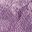

## Data Collection

### Cherry Picking approach, using the Automated Slide Analysis Platform (ASAP)

   The first approach I used for creating a suitable dataset for my model involved using the ASAP software for creating the annotations by hand. 

   For the Meastasis data points, I individually selected coordinate points in the image after looking at the boundary boxes that had been created by the pathologists.

Image depticting tumor slide 08 opened in the ASAP software
![[Screenshot 2021-08-24 001618.png]] 

### capture

---

Selection of the the tumor


Using this approach, I was able to cherry pick tumor cells make a dataset of extremely high quality. 

A similar strategy was adopted for marking the non-tumor patches. ASAP was used to mark points that were suitable examples of non tumor coordinates.

---

For the next step, I was able to write a Python script that would extract the coordinate points using the xml file produced by ASAP. The extracted points would then be used to create a set of umor and non-tumor patches based on the given coordinate points.

This process allowed as to select train a model with a very high quality dataset. However this process was manual and it took a long while to extract 100 patches from a single tif file.

As a result I only saw an accuracy of approximately 69% with the model showing a very hight tendency of overfitting.

---

## Basic CNN Model with Manual Annotations

Model Specifications:

Dataset Size = 110 for both tumor and non-tumor cells

Validation Split = 0.2 

Training Size = 88 

Validation Size = 22

Patch Size = 180 x 180

Zoom Level = 0


Example of a Normal Patch 


Example of a Tumor Patch:


The data we feeded into our Basic CNN Model looks like:


Since I was using the a Zoom Level of 0 (the highest resolution) I decided to use a relatively high patch size of 180 x 180.  In addition, a zoom level of 0 promised to give a greater localization of the tumor cells for our model.


### Data Collection Approach with manual annotations

Our model had prioritized quality of the data over the quantity. We were able to cherry pick the ideal patches by examining the tif file ourselves, and selectiong high quality patches. But it became clear that more quantity of data with fair to good quality would be preferred rather than a small dataset with the ideal quality 

 I tried data augmentation techniques to try to compensate for this issue, however this was not enough for our problem since the base dataset was too small to begin with 

        -   Expand on more results here [Add chart/graph summary] 

I needed a higer quantity of data to grasp complex features of tumor and non-tumor images. As a result, it became clear that a more complex model with a larger volume of dataset would be needed.

    -   Add model summary here 
    
        -   [Add the simple model accuracy/validation graph] 
    
        -   [ Optionally Add a confusion matrix, f1 scores, precision, accuracy, type 1 & type 2 error for this model] 

## Understanding the Tif Data

### Different Patch sizes and different Zoom levels

The Camelyon 16 dataset contains a total of 400 WSI files. The WSI .tif files contain a large amount of data. Each of these WSI files consist of magnification for 9 different levels. Correspondinly, with an increas in a level, the resolution of the image doubles, giving us twice the amount of data to work with. 

A Zoom level of 0 (which is the highes magnification level) would give us approximately 1 million by 1 million pixels to work.

Because these files our so large, for my model i selected a subset of 10 WSI files which would give be enough data to work with. 

Considering that each WSI file has \(10^6)

```latex
\(E=mc^2\)，$$x_{1,2} = \frac{-b \pm \sqrt{b^2-4ac}}{2b}.$$
```

$\alpha$

With an increase in the level of magnification, the pixel resolution doubles in resolution.

##### Patch size 32 





##### Patch size 300


## ## Second approach to patch processing - Masking

 

It was clear that the data collection approach would be unsuitable for this type of problem . The second approach we developed involved creating mask tif files of the CAMELYON dataset. We used the boundary boxes that were made by the pathologists and simply assigned a number 1 or 0 for each pixel. We did this process for each level and were able to produce a tif file that would contain a binary represntation of wether each pixel was a Metastasis pixel or a non-Metastasis one. Since this was an automated process that involved very little oversight of the batch processing. Examining the biinary representation along with the tif file, we were able to simply move a sliding "patch" window across the tumor slide and categorize the patches as tumor vs no-tumor.  

This process made it possible to collect a much larger amount of data and have a much more sophisticated model. We were only limited by our processing capacity and time. 

- For our first run we made use of only two WSI slides. We used a zoom level of 3 and cropped patches with a 32 x 32 dimension 

- [Add the simple model accuracy/validation graph] 

- [Add a confusion matrix, f1 scores, precision, accuracy, type 1 & type 2 error for this model]   

- Third iteration,  
  
  - For the next iteration of out model we chose a Zoom Level of 5 for generating out cancer dataset and a patch size of 16 x 16  
  
  - We realized that this would not only allow us to have a much larger dataset but also facilitate in a better localization of the tumor region 
  
  - Result 
  
  - Fourth Iteration  
    
    - Before vs After Data Augmentation!=
